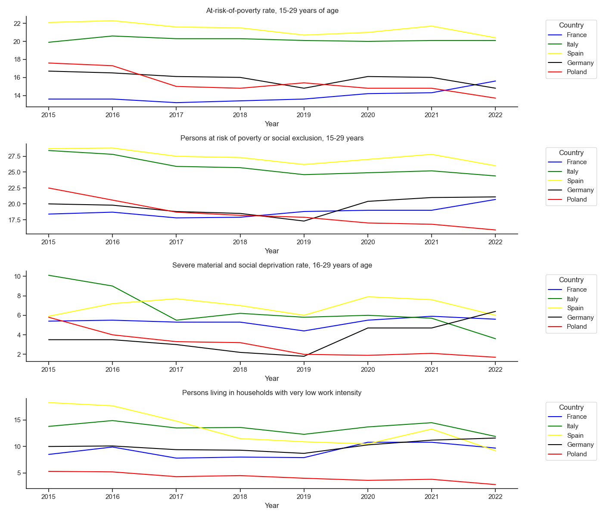
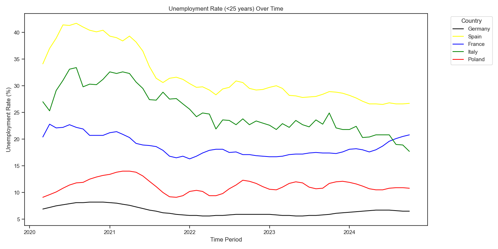

### Data Sources

1. [At-risk-of-poverty rate by poverty threshold, 15-29 years of age](https://ec.europa.eu/eurostat/databrowser/view/ilc_li02__custom_14827480/default/table?lang=en)
2. [Persons at risk of poverty or social exclusion, 15-29 years of age](https://ec.europa.eu/eurostat/databrowser/view/ilc_peps01n__custom_14827451/default/table?lang=en)
3. [Severe material and social deprivation rate, 16-29 years of age](https://ec.europa.eu/eurostat/databrowser/view/ilc_mdsd11__custom_14827256/default/table?lang=en)
4. [Persons living in households with very low work intensity, 15 to 29 years of age](https://ec.europa.eu/eurostat/databrowser/view/ilc_lvhl11__custom_14827461/default/table?lang=en)
5. [Unemployment rate, less than 25 years of age](https://ec.europa.eu/eurostat/databrowser/view/UNE_RT_M__custom_4655204/bookmark/table?lang=en&bookmarkId=6870950a-b6ad-4f89-b327-2e1829d16c11)
